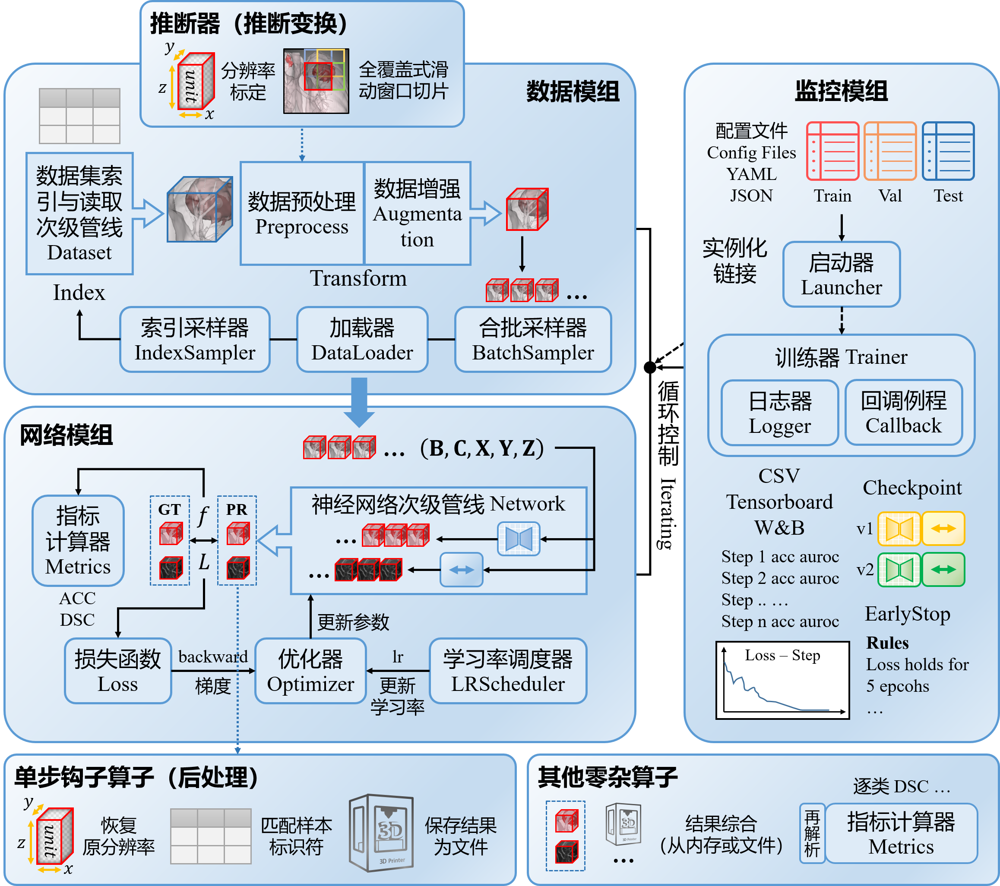
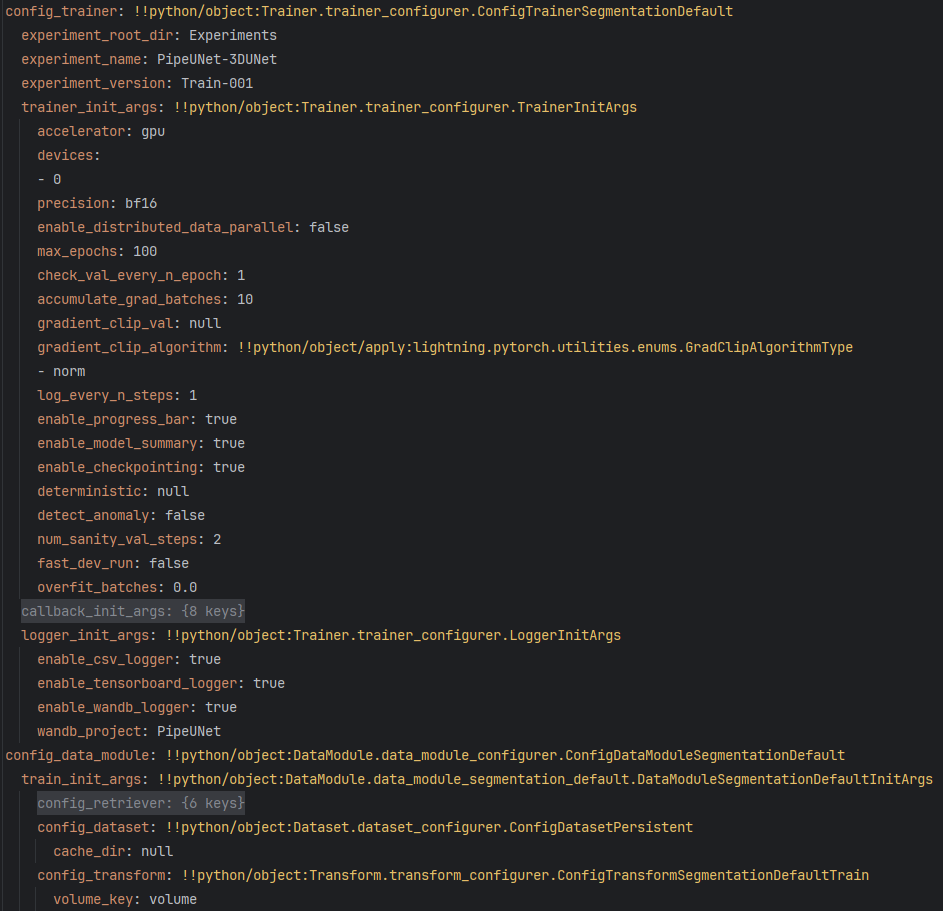
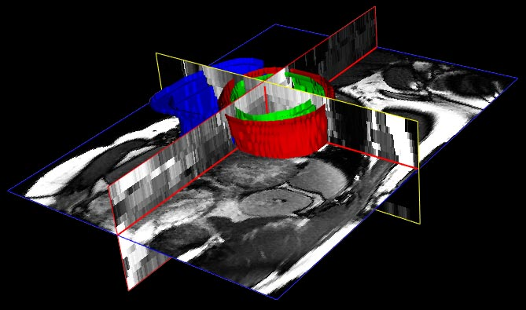
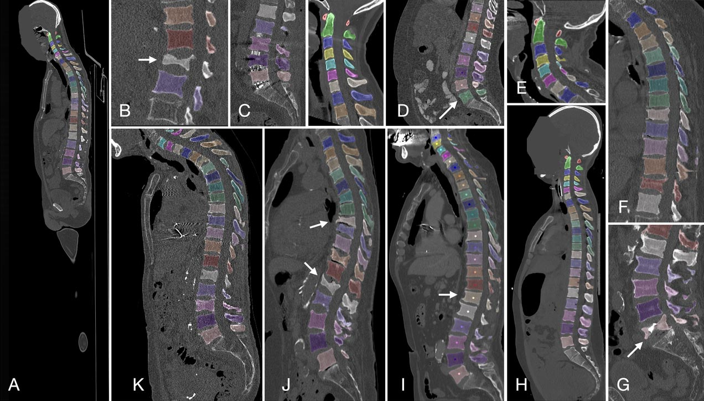
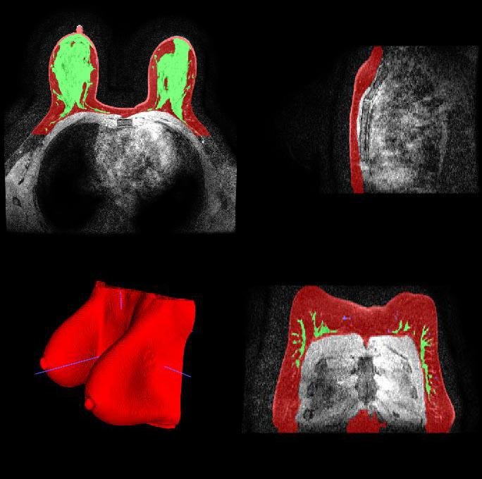
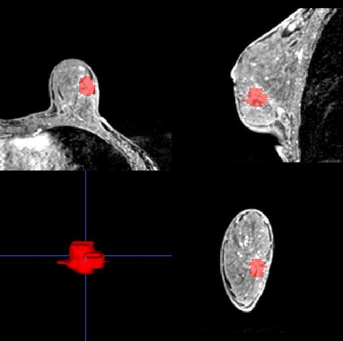
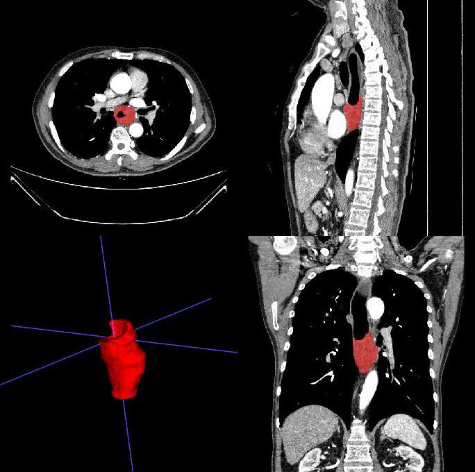

<div align="center">

# Pipelining Ur(Your) Network - PipeUNet


</div>

**PipeUNet** is a framework for general deep learning and specified 3D medical segmentation research, template for experiment oriented projects.

**PipeUNet**是一个用于深度学习科学问题研究的编程框架，同时也是一个3D医学图像分割管线的预设，适合具有一定编程基础的科研人员使用。此框架主要提供高层封装和对自定义高层封装的编程框架，具有更加明确的类型系统、较低的耦合度和数据-模型-管线-配置的高度可自定义性。如果您主要从事医学图像模型的应用研究，通常不需要对模型或管线本身进行大量修改，则推荐选择[nnUNet](https://github.com/MIC-DKFZ/nnUNet)和[Monai](https://github.com/project-monai/monai)框架，而非选择本框架。

**PipeUNet**的主要用途是作为一个编程模板使用，虽然其中定义了一些预设的算子、网络和管线，但此框架不对预设模型的实际性能做出任何保证。因为，针对实际科研问题的优化应当完全取决于您的巧思与深度设计。另外，PipeUNet并非只是一个UNet特化框架，其同样适用于搭建任意其他深度学习模型的管线。

## ***<u>为何选择PipeUNet？</u>***

- **更明确的类型**：以使用和阅读[nnUNet](https://github.com/MIC-DKFZ/nnUNet)框架代码为例，由于其缺乏类型注解而导致代码中的一些变量操作难以理解，有时甚至必须开启调试进行观察。PipeUNet尝试尽可能规避此问题，利用**Typing类型注解和Dataclass**包装强化了类型系统概念，使得弱类型Python代码更容易被理解。
- **低耦合度和扩展性**：[nnUNet](https://github.com/MIC-DKFZ/nnUNet)的封装过于完整，因此对应用研究和工程使用友好，而对需要频繁修改预处理、后处理、模型架构、训练方法管线控制代码以及可视化的研究任务十分不利，因为用户总是需要按照复杂协议重新编写代码，有时甚至难以检索所必须重新实现的组件来源，从而难以调试。PipeUNet则提供更直观的组件划分形式以便于用户对各种组件进行”**低成本**“的直接修改。
- **主流支持库的再结合**：[Monai](https://github.com/project-monai/monai)作为一个成熟的3D医学图像处理和深度学习库虽然具有许多相关研究工作，但它们大多与[PyTorch](https://pytorch.org/)直接结合使用，使得管线定义变得原始或者复杂，例程监控也显得相对原始而不充分。因此，PipeUNet致力于将Monai与在例程和监控方面发展比较成熟的Lightning框架进行**结合**，从而构建一个更加**有利于科研用途的协作模板**。

### **⭐使用最流行的工具包库作为预设**

<div align="center">
   
</div>
<p></p>
<div align="center">
  
</div>
<p></p>
<div align="center">
  
</div>
<p></p>
<div align="center">
   
</div>


### **⭐一个充分模块化和低耦合的管线框架**



### **⭐用YAML配置一切你所需要的（Config Everything）**



### **⭐YAML图形界面配置工具为你提供更好的校验和辅助**


### **⭐若干仔细清洗和整理过的3D医学图像数据集（它们都按照统一的格式存储）**

<div align="left">
   
</div>
<div align="left">
     
</div>

| 数据存档（<u>预处理细节</u>）                                | 对象                     | 任务       | 样本量 | 体积图像类型      |
| ------------------------------------------------------------ | ------------------------ | ---------- | ------ | ----------------- |
| [ACDC](DataArchive/ACDC/ACDC_data_preprocess.md)             | 心脏解剖                 | 分割，分类 | 300    | 4D Cine-MRI Frame |
| [AMOS22](DataArchive/AMOS22/AMOS22_data_preprocess.md)       | 腹部器官                 | 分割       | 360    | CT & MRI          |
| [VerSe](DataArchive/VerSe/VerSe_data_preprocess.md)          | 椎骨                     | 分割       | 374    | CT                |
| [Duke-Breast-FGT-Segmentation-2025.4.10](DataArchive/Duke-Breast-FGT-Segmentation-2025.4.10/Duke-Breast-FGT-Segmentation_data_preprocess.md) | 乳腺解剖                 | 分割       | 100    | MRI-T1CE          |
| [NME-Seg-2025.8.25](DataArchive/NME-Seg-2025.8.25/NME-Seg-2025.8.25_data_preprocess.md) | 乳腺非肿块强化灶（损伤） | 分割       | 1316   | MRI-DCE           |
| [ESO-2025.10.31](DataArchive/ESO-2025.10.31/ESO-2025.10.31_data_preprocess.md) | 食管癌（损伤）           | 分割，分类 | 548    | CT & CECT         |

来源信息：

| 数据存档                               | 公开性 | 下载                                                         | 官方网站                                                     |
| -------------------------------------- | ------ | ------------------------------------------------------------ | ------------------------------------------------------------ |
| ACDC                                   | 公开   | [[Baidu Drive](https://pan.baidu.com/s/1YklrSzE9W2FKbd65wzgOXQ?pwd=7jm3)] | https://www.creatis.insa-lyon.fr/Challenge/acdc/databases.html<br />https://humanheart-project.creatis.insa-lyon.fr/database/#collection/637218c173e9f0047faa00fb |
| AMOS22                                 | 公开   | [[Baidu Drive](https://pan.baidu.com/s/1owJdUTH5--NhuHHEI2QhMg?pwd=qu5p)] | https://amos22.grand-challenge.org<br />https://era-ai-biomed.github.io/amos/dataset.html<br />https://dataset.sribd.cn/amos.html<br />https://zenodo.org/records/7262581 |
| VerSe                                  | 公开   | [[Baidu Drive](https://pan.baidu.com/s/18AORpIDLnTYMI1VHOn6vxw?pwd=r6qa)] | https://github.com/anjany/verse.git                          |
| Duke-Breast-FGT-Segmentation-2025.4.10 | 公开   | [[Baidu Drive](https://pan.baidu.com/s/1Xx_6o4KzTK61zRUo2KAA4Q?pwd=vugf)] | https://doi.org/10.7937/TCIA.e3sv-re93                       |
| NME-Seg-2025.8.25                      | 私有   | [[Baidu Drive](https://pan.baidu.com/s/1ZRMRcmym64zsGWPsJ1fitw)] （需要密码） | 未公开（请联系 d202481651@hust.edu.cn）                      |
| ESO-2025.10.31                         | 私有   | [[Baidu Drive](https://pan.baidu.com/s/12vgxqKR-QhsBbdMN-6WooA)] （需要密码） | 未公开（请联系 d202481651@hust.edu.cn）                      |

## 环境配置

此框架目前只在非常有限的设备环境中进行了测试。以下为推荐的运行环境安装引导。

请确保系统安装了CUDA 11.8或更高版本的内核及系统驱动，在测试环境里，我们使用NVIDIA GeForce 1080 Ti GPU。

推荐使用[Miniforge](https://conda-forge.org/download)提供的Mamba包管理器进行环境配置，它可能比Conda包管理器效率更高。如果您使用Conda包管理器，请将以下命令中的`mamba`替换为`conda`。

**创建虚拟环境**

```sh
mamba create -n pipeunet python==3.9.23
```

**安装PyTorch 2.5.1**

```sh
mamba install pytorch==2.5.1 torchvision==0.20.1 torchaudio==2.5.1  pytorch-cuda=11.8 -c pytorch -c nvidia
```

**安装Lightning，Monai等工具包**

**注意**：由于依赖关系较为复杂，逐次安装可能消耗大量时间（>5h）用于计算依赖。推荐在一条命令中同时安装全部工具包从而一次性检索依赖。

```sh
mamba install lightning monai wandb matplotlib tensorboard tensorboardx nibabel simpleitk scipy scikit-learn pyyaml tqdm rich pandas openpyxl
```

**特殊：用于数据存档处理的环境配置**

由于各类数据存档所需的处理方法不同，它们可能依赖某些特定的工具包，因此请参照数据存档目录下的说明书进行单独配置。请特别注意不要将数据存档处理所使用的环境与此框架的主要环境合并到一起安装，这可能导致严重的工具包不兼容性问题。

## 关键工具包

此框架使用了一系列深度学习和医学图像处理相关工具包提供基础支持。由于在所涉及工具包中包含大量概念和接口定义，此文档只提供这些工具包在线文档或指南页面的引用，而无力提供更加具体的编程使用指导。因此，请在开始使用此框架前确保对下列工具包足够熟悉：

- **[PyTorch](https://pytorch.org/)**：深度学习的基础支持库之一，其中提供了大量预定义的张量算子和模组，以及数据集、数据加载器、优化器、学习率调度器、损失函数组件。
- **[Lightning](https://lightning.ai/docs/pytorch/stable/)**：基于PyTorch开发的中间层深度学习库，其中提供了大量的核心组件抽象、封装结构定义和埋设有大量预设钩子的例程定义。也是此框架模组划分的主要参考对象。
- **[TorchMetrics](https://lightning.ai/docs/torchmetrics/stable/)**：Lightning关于指标计算方法的扩展库之一，提供了几乎所有主流分类指标的计算与制图类定义。
- **[Monai](https://docs.monai.org.cn/en/stable/index.html)**：另一个基于PyTorch开发的中间层和高层深度学习库，同时也是中间层图像处理库，此支持库是专门针对3D医学图像任务而设计的，包含了大量3D图像处理算子、医学图像常用损失函数与指标的计算类定义以及3D大规格图像特需的缓存加载器、滑动窗口推断器等附加组件。此框架主要使用Monai的中间层支持库。
- **[Typing](https://docs.python.org/3/library/typing.html)和[Dataclasses](https://docs.python.org/3/library/dataclasses.html)**：系统库，主要提供类型注解支持和数据类封装。此框架广泛使用自定义类型对各种组件参数进行了封装，并尽量避免不明确元素类型的复合字典及列表的使用，许多组件类依赖dataclass提供初始化。此举主要是为了提高配置参数的可验证性和代码的可读性，同时便于配置信息的序列化与持久化保存。
- **[建议了解] [SimpleITK](https://simpleitk.org/)和[NiBabel](https://nipy.org/nibabel/)**：3D医学图像处理库，其地位相当于医学图像处理领域中的OpenCV。虽然Monai所提供的封装已经能够代理大多数3D医学图像处理需求，但仍建议了解用于支持Monai完成图像处理的基础支持库，它们可能在处理数据存档时被直接使用。

## 架构

**PipeUNet**是一个用于3D医学图像分割科学问题研究的编程框架，是一个系统性的深度学习实验管线模板。其中**主程序入口**位于[监控模组](#监控模组)的<u>启动器Launcher</u>中。

它主要由以下4大部分构成：

- **[数据模组](#数据模组)**：定义如何管理、解析、读取和转换数据。
- **[网络模组](#网络模组)**：定义神经网络模型的计算流和IO，性能评估和参数优化策略。
- **[监控模组](#监控模组)**：定义如何统筹调度模组协同工作和监控工作情况。
- **[工具模组](#工具模组)**：定义各种零杂算子和便捷实验工具。

***<u>为何要做这样的分工？</u>***

首先，数据和网络模组的划分是一个惯例，借用数据库的概念来说，数据模组需要应对多种多样的数据集，并将存储在外存上的数据载入内存，从**外模式**转换为**内模式**，从而使网络总是能够获得格式统一的输入。然而，在网络的输出端往往缺乏将预测结果重新从**内模式**转换为**外模式**的统一管理器，在许多实验工程里将转换和输出代码（包括结果保存和可视化）直接嵌入在迭代样本循环体中，使得程序功能被强制固化和难于扩展。

为此，监控模组应运而生，PipeUNet采用**网络模组维护单步计算、监控模组维护样本迭代**的分工模式（基于Lightning），网络模组在单步逻辑中提供可注册的调用插槽，监控模组将定义好的回调函数（在工具模组中定义）注册到插槽中从而实现各种自定义的后处理功能，用户可在工具模组中实现结果保存、路径映射和多种可视化方法并将其注册到插槽。此外，Lightning本身提供了便捷的日志工具，可以使用多种日志器和前端对指标变化情况进行追踪。

我们还发现关于**模型例程的参数配置是一个极度容易出错的人工过程**，因为实验者可能需要手动配置（无论是写代码配置或是编写YAML等文件进行配置）数十至上百个超参数才能启动一次例程（例如训练），其中除了模型和优化器等超参数以外，还包括数据IO相关的一系列路径参数；这是一个极易出错和产生遗忘问题的场景！为此，PipeUNet做出了以下尝试：

- 尽量使用dataclass和类型注解对各种参数变量提供尽可能多的使用提示，减少必须通过调试来确认参数类型的繁琐操作。
- 预设了一个可扩展的YAML可视化编辑工具，提供一定程度的类型检查、字段检索和输入验证功能。

### 数据模组

数据模组负责承担与数据存档、已封装数据集和缓存数据集进行从外存到内存的交互，执行在内存中的数据变换，以及将数据按照规范结构写入外存的任务。包括以下细分子模组（详询各子模组内部说明书）：

- **[数据存档 DataArchive](DataArchive/README_DataArchive.md)**：负责对结构散乱、携带错误的原始数据存档进行清洗和结构化数据集导出，并负责扫描数据集生成符合统一协议的索引和划分清单文件。包括离线预处理。

  **注意**：数据存档由一个独立工程维护，PipeUNet保存了其代码仓库的一个副本。详见[Med3DDataArchive](https://github.com/CyannyPasiify/Med3DDataArchive)。
- **[数据集 Dataset](Dataset/README_Dataset.md)**：负责解析清单文件内容，定位数据样本位置和将数据样本载入内存。包装自Monai和自定义。
- **[变换 Transform](Transform/README_Transform.md)**：负责对已载入内存的数据样本进行在线预处理、数据增强变换。也包括部分在线后处理变换。扩展自定义于和包装自Monai。
- **[数据模型 DataModule](DataModule/README_DataModule.md)**：负责调度数据集和变换模组协同工作，针对多种实验例程（训练、验证等）创建不同的数据装载器。负责配置参数和运行状态的记录和恢复，尤其是变换模组的随机状态。扩展自定义于Lightning。

***<u>从数据存档到数据集</u>***

同样借用数据库的概念来说，数据存档是结构杂乱的、记录和索引形式不统一的**外模式**数据包；而数据集是采用统一协议的经过仔细整理后生成的**内模式**数据包。科研中经常使用多种多样格式的数据存档，将处理逻辑嵌入于Dataset管理器中十分不利于维护和扩展，因此PipeUNet选择为每个数据存档单独定义一系列的处理例程，从而将杂乱的数据存档转换为统一结构的数据集，保存在**外存**上。

### 网络模组

网络模组负责承担神经网络定义和在各种实验例程下的计算任务。定义网络架构、损失函数、优化器、学习率调度器以及指标计算器和计算流。包括以下细分子模组（详询各子模组内部说明书）：

- **[损失 Loss](Loss/README_Loss.md)**：负责定义损失函数计算流，以及计算可微分形式的损失。包装自Monai。
- **[指标 Metric](Metric/README_Metric.md)**：负责定义指标函数计算流，以及执行指标计算。包装自TorchMetrics和Monai。
- **[优化器 Optimizer](Optimizer/README_Optimizer.md)**：负责定义网络参数优化器。包装自PyTorch。
- **[学习率调度器 LRScheduler](LRScheduler/README_LRScheduler.md)**：负责定义学习率调度器。包装自PyTorch。
- **[网络 Network](Network/README_Network.md)**：负责定义神经网络架构和前馈计算流。扩展自定义于PyTorch。
- **[推断器 Inferer](Inferer/README_Inferer.md)**：负责定义网络针对复杂输入数据的调用方式和网络输出的统筹方式。通常用于针对需要分片处理的大型单个样本的推断任务中。包装自Monai。
- **[主模型 Module](Module/README_Module.md)**：负责调度网络模组中的各模组在多种实验例程（训练、验证等）下协同工作，定义在每个例程的单个步骤中所需执行的逻辑。负责配置参数和运行状态的记录和恢复。扩展自定义于Lightning。

***<u>网络模组为何需要单独的指标计算和推断器模块？</u>***

事实上，3D图像相关的一些指标计算流程本身可能比网络更加复杂，另外由于3D图像分片推断的原因，一些指标还必须记录状态，使其工作模式更接近于管理器而非函数，因此十分有必要单独封装指标计算流程。

推断器主要用于管理3D图像分片推断流程，最常见的形式为滑动窗口推断，推断器包装了一个额外的分片预处理和镶嵌后处理流程。之所以需要推断器，是因为3D图像往往体积过大而无法一次性将整个样本载入到设备上进行预测。是否使用推断器技术也是3D图像和2D图像例程的显著区别之一。

### 监控模组

监控模组负责链接数据模组和网络模组，解析配置文件为其它模组提供恰当的初始化和维护实验日志。包括以下细分子模组（详询各子模组内部说明书）：

- [**回调 Callback**](Callback/README_Callback.md)：负责定义例程控制和表现相关的自定义功能，通过例程中的钩子进行调用。常用回调功能包括早停策略介入、模型检查点持久化、模型预览和进度条渲染。包装自Lightning。
- **[日志器 Logger](Logger/README_Logger.md)**：负责逐步骤持久化主模型状态记录，提供日志信息的结构化和可视化。例如CSV和Tensorboard日志器。包装自Lightning。
- **[训练器 Trainer](Trainer/README_Trainer.md)**：负责定义多种例程管线。称作训练器只是一种命名传统，实际上是例程管理器（Routine Manager）。其中定义了针对训练、验证、测试、预测例程的可编程管线。包装自Lightning。
- **[启动器 Launcher](Launcher/README_Launcher.md)**：负责解析命令行或YAML配置文件参数，对各模组执行初始化并启动目标例程。包括配置参数解析器。

### 工具模组

工具模组负责定义各种零杂算子和便捷实验工具。

- **[算子 Operator](Operator/README_Operator.md)**：负责定义各种零杂的可配置和持久化的算子类，用于打印日志、在损失函数或指标计算中提供自定义的附加预处理和后处理。
- **[工具 Tools](Tools/README_Tools.md)**：包含一些用于实验辅助用途的效率工具或可视化工具。当前包含一个支持输入验证的YAML图形界面编辑工具。

## 已知问题

1. Monai Metric导致的显存泄漏问题。

   参考[HausdorffDTLoss leads to GPU memory leak. · Issue #7480 · Project-MONAI/MONAI](https://github.com/Project-MONAI/MONAI/issues/7480)。

   **解决方案1**：安装`cucim`。适用于CUDA 12以上版本。

   ```sh
   mamba install cucim -c rapidsai
   ```

   **解决方案2**：在计算指标完成后显式调用GC。由于预设为CUDA 11.8，当前采用此方案。

   ```python
   gc.collect()
   ```

2. 在同一个Epoch中TorchMetrics的ROC、PR-Curve相关指标计算导致内存（或显存）占用逐渐提升，易诱发OOM的问题。

   由于此类曲线指标需要不断追加记录样本预测值，因此内存（或显存）占用逐渐提升是正常表现，在Epoch结束时汇总预测值计算后才会进行清理。

   **解决方案1**：在资源许可的条件下，可选用更大存储容量的GPU设备进行实验；如果资源紧缺，也可全部映射到CPU上利用较大的内存执行。

   **解决方案2**：采用先预测再计算指标的分步模式，即参照[nnUNet](https://github.com/MIC-DKFZ/nnUNet)模式，但是这需要自行实现单独的计算例程。
