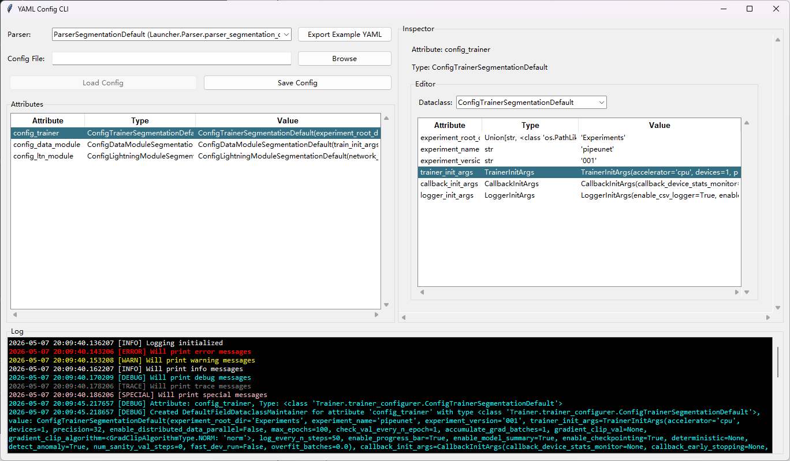
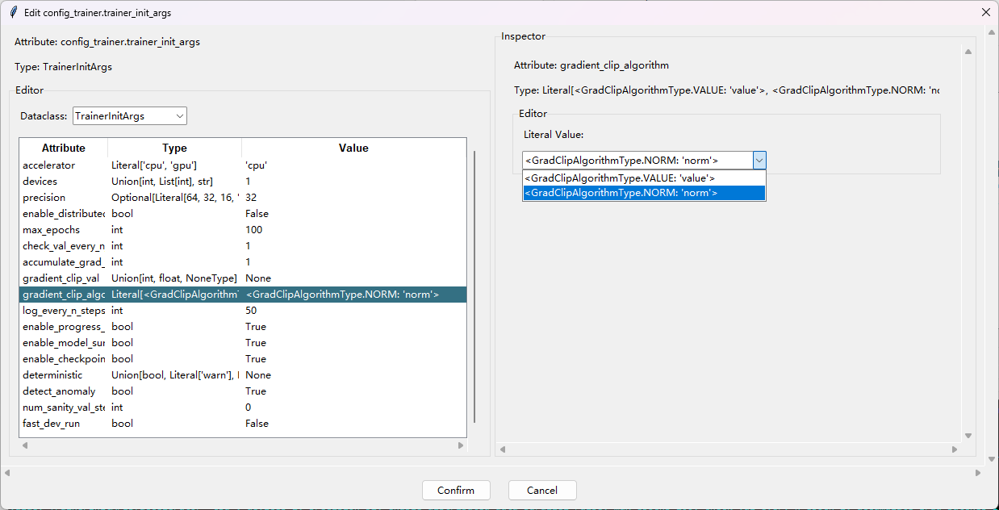

# YamlConfigurer - YAML图形界面配置工具






## 主要功能

提供一个能够解析有限类型，提示类型内所包含属性的名称、类型和值的图形界面交互式YAML配置工具。

配置工具可以对任何派生自[ParserABC](../../Launcher/Parser/parser_ABC.py)的数据类提供交互式编辑支持，同时支持示例YAML配置以及当前配置的导出。

工具界面布局采用**属性表（左）-监视器（右）-编辑器**形式，为用户提供基础性的属性检查和编辑功能。对于元组、列表、嵌套数据类等复合类型属性，还可以打开链式窗口进行内部元素编辑。

当前所支持的数据类型包括`NoneType`, `bool`, `int`, `float`, `str`, `Enum`, `Type`, `Literal`, `Optional`, `Union`, `Any`, `List`, `Tuple`, `Dict[str, *]`, `dataclass`。此工具在Python 3.9.23环境中开发和运行测试，除了原生类型`NoneType`, `bool`, `int`, `float`, `str`外，主要面向**`typing`**中的注解类型提供支持以确保向下兼容性，而对于Python 3.9+新特性中标准库泛型容器（如`list`、`dict`、`tuple`）直接用于类型注解的情况的支持度尚不明确，因此请尽量使用**`typing`**注解（如`List`、`Dict`、`Tuple`）。

## 特性

由于此YAML配置工具的主要用途是配置通常具有类型限制的深度学习管线参数，而非进行通用型YAML配置，因此 **YamlConfigurer** 使用**带有完全默认值的数据类（@dataclass）**和**类型维护器**为YAML编辑功能提供支持。

在**属性提示**、**输入验证**和**多粒度编辑**方面采用以下策略：

- 对容器型数据类提供预览表格，包含对**属性名（Attribute）**、**类型（Type）**、**值（Value）**的预览。
- 对于带有边界（Bounded）的类型声明的属性，采用**复选框**、**下拉选单**等形式提供限定，并自动校验属性值和属性类型的兼容性，如果不兼容则拒绝修改或自动重置为类型默认值。对于不带边界的类型（例如Any），将扫描当前上下文中的所有兼容类型并以**下拉选单**形式提供可选项。
- 对于`int`, `float`等依赖文本框进行编辑的类型，**使用正则表达式校验输入合法性**，确保文本内容可正确转换为数值类型。
- 考虑到YAML字典的常用形式，对`Dict`类型的支持被严格限制在`Dict[str, *]`，即**仅支持编辑以`str`字符串为键类型的字典**。
- 提供一个不可编辑的默认回退（Fallback）类型`Unsupported`用于承载配置工具所不支持的数据类型，当所有维护器都不兼容某种类型时，由`Unsupported`维护器提供只读维护。
- 对于复杂容器类型，例如嵌套列表、元组、字典，相关维护器能够提供元素级编辑功能，包括**移动、增删和编辑**元素，在编辑元素时将弹出使用元素类型维护器的**独立编辑窗口**，如果元素类型仍是容器类型，可以继续链式弹出元素编辑窗口以支持更细粒度的编辑。

为帮助您更好地理解YAML配置工具的使用方式，本节将首先介绍**带有完全默认值的数据类（@dataclass）**和**类型维护器**这2个重要概念。

### 带有完全默认值的数据类（@dataclass）

以下是一个带有完全默认值的数据类示例。我们使用`@dataclass`注解，并且要求此数据类派生自`ParserABC`。数据类的每项属性都由**属性名、类型注解和一个可选的默认值**构成。其中**类型注解**是必要的，如果您不提供类型注解，该属性将被识别为类静态属性，而非数据类实例属性。**YamlConfigurer**对数据类定义的要求更高，即默认值也成为必须声明项。**“带有完全默认值”**是指数据类中的每项属性都必须具备默认值，从而使得此数据类能够无参构造。

```python
from dataclasses import dataclass, field
from typing import Optional, Any, Dict, Union, List, Tuple, Type, Literal
from Launcher.Parser.parser_ABC import ParserABC

@dataclass
class ParserAnExample(ParserABC):
    na_1: None = None
    bool_1: bool = True
    int_1: int = 1
    float_1: float = 1.0
    str_1: str = "Hello"
    tp_1: Type[None] = type(None)
    tp_2: Type[Union[int, float]] = int
    opt_1: Optional[int] = 1
    opt_2: Optional[float] = 2.0
    un_1: Union[float, int, Type] = 1
    un_2: Union[str, int, float] = "1.0"
    any_1: Any = 1
    lt_1: Literal["a", "b", "c"] = "a"
    enum_1: PytorchPadMode = PytorchPadMode.CIRCULAR
    enum_2: NumpyPadMode = NumpyPadMode.EDGE
    enum_3: InterpolateMode = InterpolateMode.NEAREST_EXACT
    empty_tuple: Tuple[()] = ()
    int_1_tuple: Tuple[int] = (1,)
    int_2_tuple: Tuple[int, float, str] = (1, 2.0, '3s')
    int_many_tuple: Tuple[int, ...] = (1, 2, 3, 4, 5, 6)
    any_many_tuple: Tuple = (1, '2', 3.0)
    tup_list_int_bool: Tuple[List[int], List[bool]] = ([1, 2], [True, False, True])
    str_list: List[str] = field(default_factory=list)
    nested_list: List[List[List[int]]] = field(default_factory=list)
    dict_int_1: Dict[str, int] = field(default_factory=dict)
    dict_list_int_2: Dict[str, List[int]] = field(default_factory=dict)
    dc_1: SomeDataClass = SomeDataClass()  # 数据类类型 @dataclass
```

在为可变类型声明默认值时，您需要使用`dataclass`包库提供的`field(default_factory=*)`方法，其中`*`可以是一个返回所需类型值的函数。

由于Python类型注解只在编辑模式下提供软类型检查，因此您依然可以为属性提供与所声明类型不兼容的值（例如`int=1.0`），这可能导致意外风险。虽然在编辑工具中会通过维护器对类型与值的兼容性进行运行时校验，但这种校验通常仅适用于修改后的值（例如尝试从YAML载入或交互式修改`int="abc"`，此时将发生值回退，修改也将不会生效），数据类属性值的默认回退依然是在数据类中声明的默认值。虽然维护器会提供一个回退到默认值的运行时警告，但这种意外风险仍需要您自行管理。一个典型的由不兼容声明所导致的意外回退情况见以下示例。

```python
数据类设置不兼容类型的默认值 int_1: int = 1.0
→ 软类型检查提示不兼容性
→ 用户选择忽略问题
从一个修改过的YAML文件中解析载入 int_1: int = "abc"
→ 软类型检查不起作用
→ 维护器运行时类型检查提示不兼容性
→ 报告警告（但不导致中断）
→ 检查回退到默认值 int_1: int = 1.0
→ 值与类型依然不兼容，但程序不会继续Fallback了，因此载入值结果为 int_1 = 1.0
```

### 维护器 Maintainer

维护器是负责解析具体类型-值和提供编辑功能的承载对象。

一方面，维护器能够判断所指定**属性类型和属性值**是否能够由当前维护器管理；另一方面，对于能够由当前维护器管理的属性，维护器将负责创建监视器和编辑器以支持属性的交互式编辑。

[YamlConfigurer/Maintainer/base_maintainer.py](Maintainer/base_maintainer.py)的`BaseMaintainer`是所有维护器的基类，其中定义了一系列实例和静态方法，见下表。

| 方法                                        | 描述                                                         |
| ------------------------------------------- | ------------------------------------------------------------ |
| @classmethod default_standalone_window_size | 返回此类型独占编辑窗口的默认宽高。                           |
| @classmethod shall_hotkey_confirm_cancel    | 独占编辑窗口的确认/取消是否允许使用快捷键Enter/Esc。         |
| set_attribute_value                         | 设置实例中的属性值。                                         |
| is_type_compatible                          | 判断实例中的属性类型是否与此维护器兼容。                     |
| is_value_compatible                         | 判断实例中的属性类型和值是否与此维护器兼容。                 |
| get_default_value                           | 获取实例中的属性类型的默认值。                               |
| get_simplest_type                           | 获取经过化简后的实例中的属性类型。                           |
| get_simplest_type_name                      | 获取经过化简后的实例中的属性类型名称。                       |
| can_edit                                    | 判断当前维护器是否允许编辑。这通常要求is_type_compatible返回值为True。 |
| confirm_editor_change                       | 确认来自交互编辑器的修改，并修改实例中记录的属性值。         |
| create_inspector                            | 创建监视器控件面板。监视器一般负责创建预览框，并配置属性名和属性类型显示控件。然后调用create_editor创建编辑器控件面板。 |
| create_editor                               | 创建编辑器控件面板。编辑器一般负责创建属性值显示控件和多种交互式编辑控件，从而展示和修改属性值。 |
| editor_enable                               | 激活编辑器。使得编辑器可以与用户交互。                       |
| editor_disable                              | 禁用编辑器。阻止编辑器与用户交互，通常会禁用控件或将控件设置为只读。 |
| editor_set_value                            | 设置编辑器值。用新值覆盖编辑器所保存的值副本，此方法会改变编辑器控件中值的显示，但不影响维护器实例记录的属性值。 |
| editor_validate                             | 编辑器结果验证。检查和纠正用户与编辑器交互时的输入内容，返回的第1个分量决定是否要用输入内容修改编辑器所保存副本的值，第2个分量表示纠正后的输入内容（如果允许修改）。 |
| config_view                                 | 配置维护器布局。一般可在此指定维护器的编辑器窗口是采用独占模式（Standalone）还是嵌入停靠模式（Packed）。 |
| log_message                                 | 通过日志器打印日志。                                         |
| @staticmethod is_type_compatible_static     | 静态判断参数中指定的类型是否与此维护器兼容。                 |
| @staticmethod is_value_compatible_static    | 静态判断参数中指定的属性类型和值是否与此维护器兼容。         |
| @staticmethod get_default_value_static      | 静态判断参数中指定的属性类型的默认值。                       |
| @staticmethod get_simplest_type_static      | 静态获取经过化简后的参数中指定的属性类型。                   |
| @staticmethod get_simplest_type_name_static | 静态获取经过化简后的参数中指定的属性类型名称。               |

维护器的一般用法是，首先对于指定的属性类型和属性值，使用`is_type_compatible`、`is_value_compatible`、`is_type_compatible_static`、`is_value_compatible_static`系列方法判断当前维护器是否适用。对于适用的情况，则根据窗口布局调用`config_view`进行布局配置（独占还是嵌入停靠），然后通过`create_inspector`、`create_editor`方法创建交互控件并更具`can_edit`状态注册回调，在回调中使用`editor_validate`、`confirm_editor_change`验证用户输入和确认更改。

`default_standalone_window_size`和`shall_hotkey_confirm_cancel`分别提供了控件布局和回调注册所需的参数。上级对象则可以通过`get_default_value`、`get_simplest_type`、`get_simplest_type_name`、`get_default_value_static`、`get_simplest_type_static`、`get_simplest_type_name_static`获取此属性类型的一些描述信息。

针对维护器所兼容类型的不同，又可分为**基础维护器PrimitiveMaintainer**、**包装维护器WrapperMaintainer**、**容器维护器ContainerMaintainer** 3种类型。基础维护器主要负责维护一些取值有限定并且不存在子元素的基本类型，例如`int`、`float`、`bool`、`Enum`；包装维护器主要负责维护可变类型，例如`Optional`、`Union`、`Any`；容器维护器主要负责维护包含子元素的类型，例如`List`、`Tuple`、`Dict`、`dataclass`。

#### 基础维护器 PrimitiveMaintainer

[YamlConfigurer/Maintainer/primitive_maintainer.py](Maintainer/primitive_maintainer.py)的`PrimitiveMaintainer`是基础维护器的基类，派生自`BaseMaintainer`。工具预设的各基础维护器的定义详见[YamlConfigurer/Maintainer/PrimitiveMaintainer](Maintainer/PrimitiveMaintainer)，所兼容的属性类型及描述见下表。

| 维护器                | 典型类型                 | 典型值          | 描述                                                         |
| --------------------- | ------------------------ | --------------- | ------------------------------------------------------------ |
| NoneMaintainer        | type(None)               | None            | 只用于空值None的维护器。没有任何编辑功能。                   |
| BoolMaintainer        | bool                     | True            | 布尔类型维护器。提供一个复选框以进行编辑。                   |
| IntMaintainer         | int                      | 0               | 整数类型维护器。提供一个输入框以进行编辑，此输入框仅支持至多一个负号`-`前缀和数字字符。 |
| FloatMaintainer       | float                    | 0.0             | 实数类型维护器。提供一个输入框以进行编辑，此输入框支持至多一个负号`-`前缀和两种值表示法，其一为`-?(num+).(num*)`小数表示法，其二为`-?(num+)(e|E)-?(num+)`科学计数法。 |
| StrMaintainer         | str                      | 'Hello'         | 字符串类型维护器。提供一个多行输入框以进行编辑，支持显示字符和换行符输入。 |
| EnumMaintainer        | enum.Enum                | EnumType.Value  | 枚举类型维护器。提供一个下拉选单以进行编辑，从中拾取枚举值选项。 |
| LiteralMaintainer     | typing.Literal['a', 'b'] | 'a'             | 字面量类型维护器。提供一个下拉选单以进行编辑，从中拾取字面量选项。Literal的泛型具体化在编辑模式下要求仅包含不可变对象，且应当是值而非类型，但在运行时实际上可以包含任何对象而不产生任何异常。 |
| TypeMaintainer        | Type[int]                | int             | 类型维护器。提供一个下拉选单以进行编辑，从中拾取类型选项。可以和包装维护器构成复合类型，例如对于Type[Union[int, float]]类型，此时可选项将包含int与float。变体复合类型Union[Type[int], Type[float]]将被解析为前述的Type在前的形式，此二者是等价的。 |
| UnsupportedMaintainer | Path                     | Path('path/to') | 不支持维护器。此维护器能够兼容任意类型，但不提供任何编辑功能，作为维护器默认回退使用，属性类型描述将被标红，并带有(Unsupported)记号。 |

#### 包装维护器 WrapperMaintainer

[YamlConfigurer/Maintainer/wrapper_maintainer.py](Maintainer/wrapper_maintainer.py)的`WrapperMaintainer`是基础维护器的基类，派生自`BaseMaintainer`。工具预设的各包装维护器的定义详见[YamlConfigurer/Maintainer/WrapperMaintainer](Maintainer/WrapperMaintainer)，所兼容的属性类型及描述见下表。

| 维护器             | 典型类型               | 典型值          | 描述                                                         |
| ------------------ | ---------------------- | --------------- | ------------------------------------------------------------ |
| OptionalMaintainer | Optional[int]          | None, int       | 可空维护器。此维护器总是同时兼容None值和具体化类型值。编辑器中包含一个Null复选框以便于指定None值，具体化类型则由内嵌的对应类型维护器负责管理。 |
| UnionMaintainer    | Union[int, float, str] | int, float, str | 联合维护器。此维护器兼容多个具体化类型值，提供一个下拉选单用于选取目标类型，然后根据目标类型创建内嵌的对应类型维护器负责管理。 |
| AnyMaintainer      | Any                    | type            | 任意维护器。此维护器兼容任意类型值，编辑器结构与联合维护器完全相同，提供一个下拉选单用于选取目标类型，但其中包含了当前上下文中的所有类型。 |

#### 容器维护器 ContainerMaintainer

[YamlConfigurer/Maintainer/container_maintainer.py](Maintainer/container_maintainer.py)的`ContainerMaintainer`是基础维护器的基类，派生自`BaseMaintainer`。工具预设的各容器维护器的定义详见[YamlConfigurer/Maintainer/ContainerMaintainer](Maintainer/ContainerMaintainer)，所兼容的属性类型及描述见下表。

| 维护器                                | 典型类型                                                  | 典型值                            | 描述                                                         |
| ------------------------------------- | --------------------------------------------------------- | --------------------------------- | ------------------------------------------------------------ |
| ListMaintainer                        | List[int]                                                 | [1, 2, 3]                         | 列表维护器。提供一个具体化类型用于标识元素类型，此维护器兼容包含多个元素的列表。支持列表元素添加、移动、删除和编辑功能，在添加和编辑时将创建元素对应类型的维护器负责管理。 |
| TupleMaintainer                       | Tuple[()], <br />Tuple[int, int], <br />Tuple[float, ...] | (), (1, 2),<br /> (3.0, 4.0, 5.0) | 元组维护器。其具体化声明存在多种形式，具体化为`()`表示空元组类型；如果具体化为有限数量个值类型，则能够兼容按对应类型排列的值序列；还有一种使用`...`的可变长元组类型声明，此时只允许具体化1个类型，表示包含指定类型元素的变长元组。此维护器在空元组和有限值序列元组情形下只允许编辑值，而在可变长元组情形下则支持元素添加、移动、删除和编辑功能，在添加或编辑时将创建元素对应类型的维护器负责管理。 |
| StrDictMaintainer                     | Dict[str, int]                                            | {'1st': 1, '2nd': 2}              | 字符串键字典维护器。提供一个具体化类型用于标识值类型，而键类型被固定为`str`，此维护器兼容包含多个元素的字典。支持字典元素的添加、移动、删除和编辑功能，在添加和编辑时将创建元素键值对应类型的维护器负责管理。 |
| DefaultField<br />DataclassMaintainer | @dataclass <br />SomeDataClass                            | SomeDataClass<br />(param=...)    | 带有完全默认值的数据类维护器。此维护器兼容任意带有完全默认值的数据类型，可以对数据类的每个字段进行编辑，在编辑时将创建字段对应类型的维护器负责管理。 |

### 辅助函数

[YamlConfigurer/auxiliary_functions.py](auxiliary_functions.py)中提供了一些用于类型处理的辅助函数，见下表。

| 辅助函数            | 功能                                                         |
| ------------------- | ------------------------------------------------------------ |
| simplify_type       | 化简类型。这是一个递归函数，能够对输入的非最简化类型表达式进行化简以及统一化。例如Union[int, Type[int], Union[float, Type[str]]]将被化简为Union[int, float, Type[Union[int, str]]]，Union[None, int]将被化简为Optional[int]。 |
| all_available_types | 获取当前上下文中的全部类型。主要用于列出`Any`类型所能使用的全部具体类型。 |

如果您打算添加更多的类型维护器支持并且需要使用到化简，则您可以考虑修改`simplify_type`辅助函数，或者重写维护器的`get_simplest_type`、`get_simplest_type_name`、`get_simplest_type_static`、`get_simplest_type_name_static`方法。我们更推荐使用重写维护器方法的方式来实现，尽量不要直接修改`simplify_type`辅助函数，因为许多预设的类型维护器对此函数存在依赖。

### 配置项 Configurations

[YamlConfigurer/configurations.py](configurations.py)中定义了`Configurations`配置类。此配置类包含一些静态配置项目，见下表。

| 静态属性              | 描述                                                         |
| --------------------- | ------------------------------------------------------------ |
| maintainer_collection | 启用维护器列表。在其中按照优先级从高到低的顺序排列维护器类型，这些维护器将被[维护器工厂](#维护器工厂%20MaintainerFactory)引用，用于执行属性类型的匹配。注意，最好总是将`UnsupportedMaintainer`放在最后，以便任意类型最终都能找到一个能够承载的维护器。 |
| all_available_types   | 获取当前上下文中的全部类型。主要用于列出`Any`类型所能使用的全部具体类型。 |

### 维护器工厂 MaintainerFactory

[YamlConfigurer/maintainer_factory.py](maintainer_factory.py)中定义了`MaintainerFactory`工厂类，其中提供了一些用于根据指定属性类型和属性值构造维护器的工厂方法，以及获取维护器类型、获取类型最简名称的方法，见下表。

| 静态方法                                | 功能                                                         |
| --------------------------------------- | ------------------------------------------------------------ |
| get_maintainer_supported_type_value     | 接收属性名、属性类型、属性值参数，遍历所有启用的维护器寻找一个能够**兼容类型与值**的维护器，构造此维护器的实例。 |
| get_maintainer_supported_type           | 接收属性名、属性类型、[可选的]属性值参数，遍历所有启用的维护器寻找一个能够**兼容类型**的维护器，构造此维护器的实例。 |
| get_maintainer_supported_value          | 接收属性名、属性值参数，从属性值推导属性类型，遍历所有启用的维护器寻找一个能够**兼容类型与值**的维护器，构造此维护器的实例。 |
| get_maintainer_cls_supported_type_value | 接收属性类型、属性值参数，遍历所有启用的维护器寻找一个能够**兼容类型与值**的维护器，返回此维护器类型。 |
| get_maintainer_cls_supported_type       | 接收属性类型参数，遍历所有启用的维护器寻找一个能够**兼容类型**的维护器，返回此维护器类型。 |
| get_maintainer_cls_supported_value      | 接收属性值参数，从属性值推导属性类型，遍历所有启用的维护器寻找一个能够**兼容类型与值**的维护器，返回此维护器类型。 |
| get_simplest_type_name                  | 接收属性类型参数，遍历所有启用的维护器寻找一个能够**兼容类型**的维护器，通过此维护器获取化简后的属性类型名称。 |

### 主客户端 YAMLConfigCLI

[YamlConfigurer/yaml_config_cli.py](yaml_config_cli.py)中定义了`YAMLConfigCLI`主客户端类。主客户端类负责创建顶级窗口对象，并在其中布局Parser解析器数据类的选择、显示、导入、导出、编辑功能面板。如下图所示，左上角为解析器选择及导入导出功能区，左中为当前解析器的成员一览；当选中某一项属性时，右侧监视器面板将显示当前选中属性的细节信息，以及交互式编辑器。程序执行过程中的分级日志信息将打印与下方的日志面板中，其中包含5个信息等级预设，即`ERROR`, `WARN`, `INFO`, `DEBUG` `TRACE`，以及特殊信息等级（其指示词可任意自定义，不限数量，例如`SPECIAL`）。


## 自定义

您可能希望在此YAML配置工具中添加对新解析器（派生自`ParserABC`）的支持，或是添加对更多类型维护器的支持。本节将简单介绍实现以上目标的途径和方法，其中添加新解析器支持相对简单，只需将解析器类注册到`Configurations`配置类静态成员中即可；添加自定义维护器相对复杂，因为这意味着您必须完全实现在[维护器 Maintainer](#维护器%20Maintainer)一节所提供方法表格中提及的全部方法，其中的许多逻辑都需要针对维护器的目标类型进行单独定义。

以下是节选自[YamlConfigurer/configurations.py](configurations.py)中`Configurations`配置类的代码。此配置类包含`maintainer_collection`静态成员和`parser_collection`静态成员。您需要将新自定义维护器添加至`maintainer_collection`中（请注意添加位置，在探测维护器兼容性时将按照从上到下的顺序依次尝试，直到匹配到第一个兼容的维护器），将新解析器添加至`parser_collection`列表中（声明顺序只影响在下拉选单中的显示顺序）。

```python
# Tools/YamlConfigurer/configurations.py
class Configurations:
    # The sequence order is critical, in generic ascending manner
    maintainer_collection: List[Type[BaseMaintainer]] = [
        NoneMaintainer,
        BoolMaintainer,
        IntMaintainer,
        FloatMaintainer,
        StrMaintainer,
        EnumMaintainer,
        LiteralMaintainer,
        TypeMaintainer,
        OptionalMaintainer,
        UnionMaintainer,
        AnyMaintainer,
        ListMaintainer,
        TupleMaintainer,
        StrDictMaintainer,
        DefaultFieldDataclassMaintainer,
        UnsupportedMaintainer,
    ]

    parser_collection: List[Type[ParserABC]] = [
        ParserSegmentationDefault
    ]
```

### 添加解析器

在添加解析器时首先需要您定义一个派生自`ParserABC`的**带有完全默认值的数据类**，建议您在[Launcher/Parser](../../Launcher/Parser)目录下建立单独的`.py`代码文件，并在其中定义一个数据类。数据类应当使用`@dataclass`注解，并在其中按照下述格式定义属性字段。

```python
<name>: <type> = <default>
```

即**属性名，属性类型和属性默认值**信息，请注意不能缺失属性类型或属性默认值，否则将导致逻辑错误，以下是不合法的属性字段定义示例。

```python
<name>: <type>  # 无默认值，无法通过无参初始化函数进行实例化
<name> = <default>  # 无属性类型，定义的是静态成员，而非实例属性字段。
```

以下是一个`ParserStudent`数据类的定义

```python
@dataclass
class ParserStudent(ParserABC):
    id_name: str = ''  # 姓名
    grade: int = 0  # 年级
    seat_coord: Tuple[int, int] = (0, 0)  # 座位(行, 列)
```

而后将其注册到`parser_collection`，这样您就可以在主客户端左上的解析器下拉选单中找到此解析器并进行配置了。

```python
# Tools/YamlConfigurer/configurations.py
class Configurations:
    ...
    parser_collection: List[Type[ParserABC]] = [
        ParserSegmentationDefault,
        ParserStudent
    ]
```

您可以通过定义`dump_example_to_yaml`方法来提供默认YAML配置导出示例，从而使得主客户端左上的**Export Example YAML**按钮正常工作，并导出针对此`ParserStudent`解析器的示例YAML配置文件。

```python
@staticmethod
def dump_example_to_yaml(
    export_path: Optional[Union[str, os.PathLike, Path]],
    default_style: Optional[str] = None,
    default_flow_style: Optional[bool] = False,
    canonical: Optional[bool] = None,
    indent: Optional[int] = 2,
    width: Optional[Union[int, float]] = None,
    allow_unicode: Optional[bool] = None,
    line_break: Optional[str] = None,
    encoding: Optional[str] = None,
    explicit_start: Optional[bool] = None,
    explicit_end: Optional[bool] = None,
    version: Optional[tuple[int, int]] = None,
    tags: Optional[Mapping[str, str]] = None,
    sort_keys: bool = False
) -> Optional[str]:
    id_name: str = 'Tony Cyan'  # 姓名
    grade: int = 4  # 年级
    seat_coord: Tuple[int, int] = (1, 3)  # 座位(行, 列)
    
    export_dict: Dict[str, Any] = {
        'id_name': id_name,
        'grade': grade,
        'seat_coord': seat_coord
    }
    
    # 将要使用的YAML导出器
    dumper = yaml.Dumper

    if export_path is not None:
        # Dump config to YAML file
        Path(export_path).parent.mkdir(parents=True, exist_ok=True)
        with open(export_path, 'w', encoding='utf-8') as file:
            yaml.dump(
                export_dict, file, dumper,
                default_style=default_style,
                default_flow_style=default_flow_style,
                canonical=canonical,
                indent=indent,
                width=width,
                allow_unicode=allow_unicode,
                line_break=line_break,
                encoding=encoding,
                explicit_start=explicit_start,
                explicit_end=explicit_end,
                version=version,
                tags=tags,
                sort_keys=sort_keys
            )
        return None
    else:
        return yaml.dump(
            export_dict, None, dumper,
            default_style=default_style,
            default_flow_style=default_flow_style,
            canonical=canonical,
            indent=indent,
            width=width,
            allow_unicode=allow_unicode,
            line_break=line_break,
            encoding=encoding,
            explicit_start=explicit_start,
            explicit_end=explicit_end,
            version=version,
            tags=tags,
            sort_keys=sort_keys
        )
```

如果您所定义的解析器使用了一些不被`yaml.Dumper`支持的数据类型，您还可以对导出器进行自定义，请参考[Launcher/Parser/parser_segmentation_default.py](../../Launcher/Parser/parser_segmentation_default.py)中定义的`YamlDumperSegmentationDefault`类以及[PyYAMLDocumentation](https://pyyaml.org/wiki/PyYAMLDocumentation)文档。

### 添加自定义维护器

添加自定义维护器是一个较为复杂的过程，您必须完全实现在[维护器 Maintainer](#维护器%20Maintainer)一节所提供方法表格中提及的全部方法，以下我们以[`IntMaintainer`](Maintainer/PrimitiveMaintainer/int_maintainer.py)为例对其中定义的一些方法进行快速浏览和解释。

首先导入必要的包库及其中的类型、函数。

```python
from typing import Any, Tuple, Type, Callable, Optional  # 类型注解，提升可读性
from typing_extensions import override  # 重写方法注解
import tkinter as tk  # 控件库，定义了一些常用控件
from tkinter import ttk  # 控件库，控件扩展包
import re  # 正则匹配，用于执行输入验证
from Tools.YamlConfigurer.Maintainer.primitive_maintainer import PrimitiveMaintainer  # 基础维护器基类，从这里派生
from Tools.YamlConfigurer.auxiliary_functions import simplify_type  # 化简类型辅助函数
```

开始定义`IntMaintainer`，它派生自`PrimitiveMaintainer`。初始化方法接收4个附加参数，即属性名、属性类型、属性值和日志器，日志器一般总是可以从上级直接获取。初始化逻辑方面，首先调用`simplify_type`辅助函数将传入参数`attribute_type`属性类型化至最简，然后调用基类初始化，最后定义用于监视器和编辑器的控件引用（初始化为`None`）。

```python
class IntMaintainer(PrimitiveMaintainer):
    def __init__(
            self,
            attribute_name: str = "",
            attribute_type: Type = int,
            attribute_value: Any = 0,
            logger: Any = None
    ):
        """Initialize Maintainer

        Args:
            attribute_name: Name of the attribute
            attribute_type: Type of the attribute
            attribute_value: Initial value
            logger: Logger instance for logging
        """
        # Simplify first !!
        attribute_type: Type = simplify_type(attribute_type)
        super().__init__(attribute_name, attribute_type, attribute_value, logger)
        # Widgets
        self.value_label: Optional[ttk.Label] = None
        self.value_string_var: Optional[tk.StringVar] = None
        self.entry: Optional[ttk.Entry] = None
```

以下是与`IntMaintainer`兼容性判别相关的实例和静态方法。类型兼容判别方法`is_type_compatible`和`is_type_compatible_static`直接判断属性类型是否为`int`即可确定此维护器对类型的兼容性。值兼容判别方法`is_value_compatible`和`is_value_compatible_static`也采用类似判断方法，要求属性值的类型是`int`类型，其中实例方法`is_value_compatible`还联合`is_type_compatible`进行判断，这是因为对于记录了属性类型的实例而言，属性值和维护器兼容必须以属性类型兼容为前提，这对于确定维护器的可编辑性质至关重要。而静态方法则直接忽略对`target_type`的判断，这是因为此参数的功能与`self.attribute_type`的意义不同，它被设计为用于补充类型约束信息以辅助值兼容性判断；然而`int`类型的判断完全不需要其他补充信息，因此这个参数未被使用。事实上，`target_type`参数在包装维护器`WrapperMaintainer`和容器维护器`ContainerMaintainer`中得到了关键应用，因为其兼容性判断依赖于泛型参数的具体化声明。

```python
class IntMaintainer(PrimitiveMaintainer):
    @override
    def is_type_compatible(self) -> bool:
        return self.attribute_type is int

    @override
    def is_value_compatible(self) -> bool:
        return self.is_type_compatible() and type(self.attribute_value) is int
    
    @staticmethod
    @override
    def is_type_compatible_static(target_type: Type) -> bool:
        return simplify_type(target_type) is int

    @staticmethod
    @override
    def is_value_compatible_static(value: Any, target_type: Type = None) -> bool:
        return type(value) is int
```

以下是与`IntMaintainer`描述相关的实例和静态方法，包括获取整数默认值、最简兼容类型、最简兼容类型名称的方法，它们主要用于构造关于此维护器的描述信息，有时也作为获取兜底回退值的途径。

```python
class IntMaintainer(PrimitiveMaintainer):
    @override
    def get_default_value(self, *args, **kwargs) -> int:
        return 0

    @override
    def get_simplest_type(self, *args, **kwargs) -> Type[int]:
        return int

    @override
    def get_simplest_type_name(self, *args, **kwargs) -> str:
        return "int"

    @staticmethod
    @override
    def get_default_value_static(*args, **kwargs) -> int:
        return 0

    @staticmethod
    @override
    def get_simplest_type_static(*args, **kwargs) -> Type[int]:
        return int

    @staticmethod
    @override
    def get_simplest_type_name_static(*args, **kwargs) -> str:
        return "int"
```

以下是`IntMaintainer`创建监视器和编辑器的关键方法。两个方法都包含上级控件引用参数`parent`和调用者提供的值变化回调`on_value_change`，其中`on_value_change`是链接当前维护器状态变化和上级调用者的关键通道。

`create_inspector`直接调用基类`PrimitiveMaintainer`的方法，此基类方法将创建右侧监视器面板（带Inspector标题的栏框）以及创建Attribute属性名、Type属性类型标签控件、Editor标题栏框控件，最后调用`create_editor`方法在Editor栏框中创建下辖的嵌入停靠编辑器。

`create_editor`同样首先调用基类`PrimitiveMaintainer`的方法，然后创建特有控件，包括一个Value标签控件和一个Entry文本输入控件，Entry控件将模式`'^-?\d*$'`注册为输入验证器。同时绑定了一系列事件回调，在按下回车、Esc快捷键或Entry失去焦点时调用`_on_content_change`验证输入并向上传递修改信息。

```python
class IntMaintainer(PrimitiveMaintainer):
    @override
    def create_inspector(
            self,
            parent: ttk.Widget,
            on_value_change: Optional[Callable[[Any], None]] = None,
    ) -> ttk.Widget:
        """
            Shall call create_editor()
        """
        return super().create_inspector(parent, on_value_change)

    @override
    def create_editor(
            self,
            parent: ttk.Widget,
            on_value_change: Optional[Callable[[Any], None]] = None,
    ) -> ttk.Widget:
        super().create_editor(parent, on_value_change)

        self.value_label = ttk.Label(self.editor, text="Value:")
        self.value_label.pack(anchor=tk.W, padx=10, pady=5)

        # Regex for int: allow optional minus sign followed by digits
        int_pattern = re.compile(r'^-?\d*$')

        def on_validate(P: str):
            """Validate input using regex"""
            if P == "":
                return True
            return bool(int_pattern.match(P))

        validate_cmd: str = parent.register(on_validate)

        valid_value: Any = self.attribute_value
        if not self.is_value_compatible():
            valid_value = self.get_default_value()
        self.value_string_var = tk.StringVar(value=str(valid_value))

        self.entry = ttk.Entry(
            self.editor,
            textvariable=self.value_string_var,
            validate="key",
            validatecommand=(validate_cmd, '%P')
        )
        self.entry.pack(anchor=tk.W, padx=10, pady=5)
        self.entry.bind("<Return>", self._on_content_change)  # Return to confirm
        self.entry.bind("<Escape>", self._on_content_change)  # ESC to confirm
        self.entry.bind("<FocusOut>", self._on_content_change)  # Lose focus to confirm

        self.entry.focus_set()
        self.entry.selection_range(0, tk.END)
        self.entry.icursor(tk.END)
        return self.editor

    def _on_content_change(self, event: Optional[tk.Event] = None):
        """Handle value change"""
        input_value: str = self.value_string_var.get()
        is_valid, validated_value = self.editor_validate(input_value)
        if is_valid:
            self.editor_value = validated_value
            self.on_value_change(validated_value)
```

最后，`IntMaintainer`还重写了编辑器控制方法`editor_enable`、`editor_disable`、`editor_set_value`、`editor_validate`。`editor_enable`激活与`editor_disable`禁用编辑器方法主要是在修改Entry文本输入控件的可用状态，以及绑定与解绑确认输入事件。`editor_set_value`编辑器值设置方法将Entry文本输入控件的值字符中转对象设置为新值，注意编辑器使用的属性值是一个独立副本，它只影响控件的显示效果，修改编辑器值不会导致维护器真正记录的`self.attribute_value`属性值发生变化，将`self.attribute_value`与编辑器值同步需要调用者显式调用`confirm_editor_change`方法。`editor_validate`在`_on_content_change`回调中被使用，此方法主要用于验证维护器的状态修改，从而确认是否需要通知调用者，它采用模式`'^-?\d*$'`对`int`值的字符串表示进行校验。校验通过时，返回`(True, int(input_value))`，即校验通过状态和修改后的`int`值；失败时返回`(False, None)`，即校验失败状态和空值。

```python
class IntMaintainer(PrimitiveMaintainer):
    @override
    def editor_enable(self):
        if self.editor is not None:
            self.entry.config(state='normal')
            self.entry.bind("<Return>", self._on_content_change)  # Return to confirm
            self.entry.bind("<Escape>", self._on_content_change)  # ESC to confirm
            self.entry.bind("<FocusOut>", self._on_content_change)  # Lose focus to confirm
        super().editor_enable()

    @override
    def editor_disable(self):
        if self.editor is not None:
            self.entry.config(state='disabled')
            self.entry.unbind("<Return>")  # Return to confirm
            self.entry.unbind("<Escape>")  # ESC to confirm
            self.entry.unbind("<FocusOut>")  # Lose focus to confirm
        super().editor_disable()

    @override
    def editor_set_value(self, new_value: int):
        if self.editor is not None:
            self.editor_value = new_value
            self.value_string_var.set(str(new_value))
        super().editor_set_value(new_value)

    @override
    def editor_validate(self, input_value: str) -> Tuple[bool, Optional[int]]:
        """Validate input value for int using regex

        Args:
            input_value: Input value to validate

        Returns:
            (is_valid, validated_value)
        """
        if input_value == "":
            return False, None
        # Allow optional minus sign followed by digits
        int_pattern = re.compile(r'^-?\d+$')
        if int_pattern.match(input_value):
            try:
                return True, int(input_value)
            except ValueError:
                return False, None
        return False, None
```

以下是[int_maintainer.py](Maintainer/PrimitiveMaintainer/int_maintainer.py)的完整代码文件内容。

```python
# Tools/YamlConfigurer/Maintainer/PrimitiveMaintainer/int_maintainer.py
from typing import Any, Tuple, Type, Callable, Optional
from typing_extensions import override
import tkinter as tk
from tkinter import ttk
import re
from Tools.YamlConfigurer.Maintainer.primitive_maintainer import PrimitiveMaintainer
from Tools.YamlConfigurer.auxiliary_functions import simplify_type

class IntMaintainer(PrimitiveMaintainer):
    """int type Maintainer"""
    def __init__(
            self,
            attribute_name: str = "",
            attribute_type: Type = int,
            attribute_value: Any = 0,
            logger: Any = None
    ):
        """Initialize Maintainer

        Args:
            attribute_name: Name of the attribute
            attribute_type: Type of the attribute
            attribute_value: Initial value
            logger: Logger instance for logging
        """
        # Simplify first !!
        attribute_type: Type = simplify_type(attribute_type)
        super().__init__(attribute_name, attribute_type, attribute_value, logger)
        # Widgets
        self.value_label: Optional[ttk.Label] = None
        self.value_string_var: Optional[tk.StringVar] = None
        self.entry: Optional[ttk.Entry] = None

    @override
    def is_type_compatible(self) -> bool:
        return self.attribute_type is int

    @override
    def is_value_compatible(self) -> bool:
        return self.is_type_compatible() and type(self.attribute_value) is int

    @override
    def get_default_value(self, *args, **kwargs) -> int:
        return 0

    @override
    def get_simplest_type(self, *args, **kwargs) -> Type[int]:
        return int

    @override
    def get_simplest_type_name(self, *args, **kwargs) -> str:
        return "int"

    @override
    def create_inspector(
            self,
            parent: ttk.Widget,
            on_value_change: Optional[Callable[[Any], None]] = None,
    ) -> ttk.Widget:
        """
            Shall call create_editor()
        """
        return super().create_inspector(parent, on_value_change)

    @override
    def create_editor(
            self,
            parent: ttk.Widget,
            on_value_change: Optional[Callable[[Any], None]] = None,
    ) -> ttk.Widget:
        super().create_editor(parent, on_value_change)

        self.value_label = ttk.Label(self.editor, text="Value:")
        self.value_label.pack(anchor=tk.W, padx=10, pady=5)

        # Regex for int: allow optional minus sign followed by digits
        int_pattern = re.compile(r'^-?\d*$')

        def on_validate(P: str):
            """Validate input using regex"""
            if P == "":
                return True
            return bool(int_pattern.match(P))

        validate_cmd: str = parent.register(on_validate)

        valid_value: Any = self.attribute_value
        if not self.is_value_compatible():
            valid_value = self.get_default_value()
        self.value_string_var = tk.StringVar(value=str(valid_value))

        self.entry = ttk.Entry(
            self.editor,
            textvariable=self.value_string_var,
            validate="key",
            validatecommand=(validate_cmd, '%P')
        )
        self.entry.pack(anchor=tk.W, padx=10, pady=5)
        self.entry.bind("<Return>", self._on_content_change)  # Return to confirm
        self.entry.bind("<Escape>", self._on_content_change)  # ESC to confirm
        self.entry.bind("<FocusOut>", self._on_content_change)  # Lose focus to confirm

        self.entry.focus_set()
        self.entry.selection_range(0, tk.END)
        self.entry.icursor(tk.END)
        return self.editor

    def _on_content_change(self, event: Optional[tk.Event] = None):
        """Handle value change"""
        input_value: str = self.value_string_var.get()
        is_valid, validated_value = self.editor_validate(input_value)
        if is_valid:
            self.editor_value = validated_value
            self.on_value_change(validated_value)

    @override
    def editor_enable(self):
        if self.editor is not None:
            self.entry.config(state='normal')
            self.entry.bind("<Return>", self._on_content_change)  # Return to confirm
            self.entry.bind("<Escape>", self._on_content_change)  # ESC to confirm
            self.entry.bind("<FocusOut>", self._on_content_change)  # Lose focus to confirm
        super().editor_enable()

    @override
    def editor_disable(self):
        if self.editor is not None:
            self.entry.config(state='disabled')
            self.entry.unbind("<Return>")  # Return to confirm
            self.entry.unbind("<Escape>")  # ESC to confirm
            self.entry.unbind("<FocusOut>")  # Lose focus to confirm
        super().editor_disable()

    @override
    def editor_set_value(self, new_value: int):
        if self.editor is not None:
            self.editor_value = new_value
            self.value_string_var.set(str(new_value))
        super().editor_set_value(new_value)

    @override
    def editor_validate(self, input_value: str) -> Tuple[bool, Optional[int]]:
        """Validate input value for int using regex

        Args:
            input_value: Input value to validate

        Returns:
            (is_valid, validated_value)
        """
        if input_value == "":
            return False, None
        # Allow optional minus sign followed by digits
        int_pattern = re.compile(r'^-?\d+$')
        if int_pattern.match(input_value):
            try:
                return True, int(input_value)
            except ValueError:
                return False, None
        return False, None

    @staticmethod
    @override
    def is_type_compatible_static(target_type: Type) -> bool:
        return simplify_type(target_type) is int

    @staticmethod
    @override
    def is_value_compatible_static(value: Any, target_type: Type = None) -> bool:
        return type(value) is int

    @staticmethod
    @override
    def get_default_value_static(*args, **kwargs) -> int:
        return 0

    @staticmethod
    @override
    def get_simplest_type_static(*args, **kwargs) -> Type[int]:
        return int

    @staticmethod
    @override
    def get_simplest_type_name_static(*args, **kwargs) -> str:
        return "int"
```

